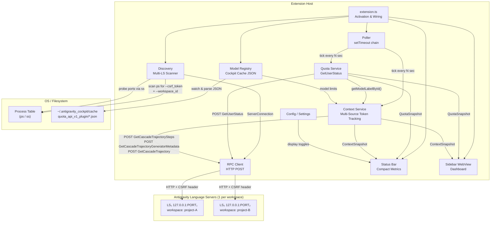
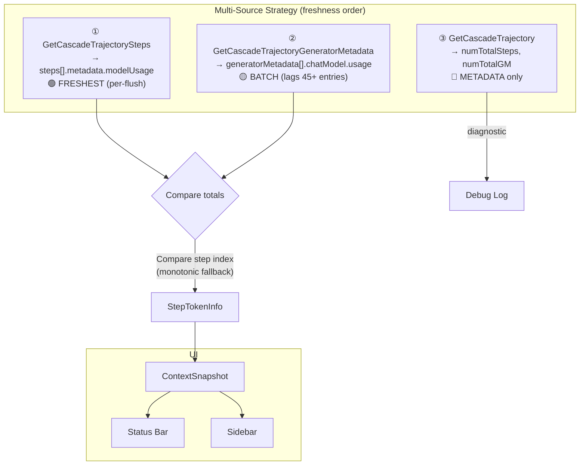
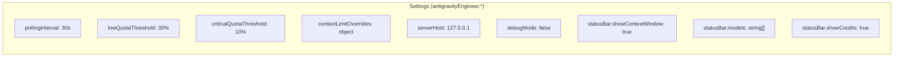

# Antigravity Engineer — Architecture

## Overview

VS Code extension for Google Antigravity IDE that provides real-time monitoring of context window usage, model quotas, and token consumption by reverse-engineering the internal language server RPC API.

## Architecture Diagram



## Data Flow — Token Tracking



### Multi-LS Architecture

Antigravity spawns **one Language Server per workspace**. Each LS has its own:
- PID, PPID, CSRF token, workspace_id
- HTTP port (JSON-RPC), HTTPS port (gRPC), extension port
- In-memory trajectory fork after `LoadTrajectory`

**Critical**: A cascade/conversation may be loaded on ANY LS — not necessarily the one matching the current VS Code workspace. Per-conversation reads must be routed through the LS that owns the data, which may differ from the workspace-matched LS.

**Workspace-based priority** (v0.3.8): Discovery sorts LS candidates by `workspace_id` match against the current VS Code workspace path. Each IDE window runs its own Extension Host; since LS processes are children of `--type=utility` workers (not Extension Hosts directly), PPID matching is not reliable and was removed.

Discovery logs the computed `wsId` and each candidate with MATCH/no annotation:
```
Workspace matching: wsId="file_home_user_project_A" | candidates: file_home_user_project_A(MATCH), file_home_user_project_B(no)
```

### LS RPC Endpoints — API Reference

| Endpoint | Purpose | Status | Freshness |
|---|---|---|---|
| `GetUserStatus` | Plan, quotas, model configs | ✅ Live, primary | Real-time |
| `GetAllCascadeTrajectories` | Discover cascadeId by workspace | ✅ Live (may return empty) | Real-time |
| `GetCascadeTrajectorySteps` | Step buffer (~1135 sliding window) | ✅ **Primary token source** | Per-flush (freshest) |
| `GetCascadeTrajectoryGeneratorMetadata` | GM array — one per LLM call | ✅ **Fallback token source** | Batch (lags 45+ entries) |
| `GetCascadeTrajectory` | Trajectory summary + `numTotalSteps`/`numTotalGM` | ✅ Diagnostics | Per-flush |
| `GetUserTrajectoryDescriptions` | List of trajectory IDs per workspace | ✅ Live, discovery only | Real-time |
| `StreamAgentStateUpdates` | Real-time push of full state | ⚠️ Works (initial snapshot only) | Real-time during RUNNING |
| `GetBrowserOpenConversation` | Currently open conversation | ⚠️ Only if browser panel open | Real-time |

### Token Data Sources

#### Source 1: Steps `modelUsage` (Primary)

`GetCascadeTrajectorySteps` returns a sliding window of ~1135 steps. Each step with `metadata.modelUsage` contains:

| Field | Type | Description |
|---|---|---|
| `inputTokens` | string | Uncached prompt tokens |
| `cacheReadTokens` | string | Cached prompt tokens (Anthropic prompt cache) |
| `outputTokens` | string | Model output tokens |
| `model` | string | Internal model ID |
| `apiProvider` | string | Provider (e.g. `API_PROVIDER_ANTHROPIC_VERTEX`) |

Walking backwards from the last step gives the **freshest available token counts**.

#### Source 2: GeneratorMetadata (Fallback)

`GetCascadeTrajectoryGeneratorMetadata` returns the full `generatorMetadata[]` array. Each entry has `chatModel.usage` with the same fields. Updates in **batches** — can lag behind Steps by 45+ entries and 50K+ tokens.

#### Token Formula

**Context window usage** = `estimatedTokensUsed ?? (inputTokens + cacheReadTokens + outputTokens)`

> When available, `estimatedTokensUsed` from `chatModel.contextWindowMetadata` is the authoritative server-computed value.
> Fallback: `inputTokens` (uncached) + `cacheReadTokens` (cached) + `outputTokens`.
> Both input components occupy context window space.

### API Behavior Notes

- **`GetCascadeTrajectorySteps`**: Returns a ~1135-step sliding window. Ignores `startIndex`/`endIndex` params — always returns the same window centered around the latest checkpoint. The LAST step with `modelUsage` is the freshest token data.
- **`GetCascadeTrajectoryGeneratorMetadata`**: Returns the full `generatorMetadata[]` array directly. Batch-updated: `numTotalGM` (from trajectory) can exceed the returned array size by 45+ entries. No pagination params.
- **`GetCascadeTrajectory`**: Returns `numTotalSteps` and `numTotalGeneratorMetadata` for diagnostic comparison. GM entries nested inside `trajectory.generatorMetadata[]` — often less fresh than the dedicated GM endpoint.
- **`StreamAgentStateUpdates`**: Requires Connect streaming framing:
  - `Content-Type: application/connect+json`
  - Binary envelope: `0x00 + uint32_be(length) + JSON_payload`
  - Returns full state snapshot (17MB+) as first frame
  - Accepts `{conversationId}` (same as cascadeId)
  - `transfer-encoding: chunked` — long-lived connection
  - During IDLE: sends initial snapshot only, no further deltas observed
  - During RUNNING: likely sends delta frames (not yet confirmed)
  - Future work: implement as primary real-time source

## Module Responsibilities

### Extension Host (`extension.ts`)
- Governs lifecycle and immediate wiring.
- **Sync-First Binding**: WebviewViewProvider endpoints and Commands are attached synchronously right at activation (`onView` / `onCommand`). This satisfies VS Code's view lifecycle boundaries, preventing failures if initialization components like `ModelRegistry` act asynchronously.
- State restoration from `globalState` cache directly passes rehydrated object hierarchies into initializing singletons (like Quota Service and Context Service).

### Discovery (`platform/discovery.ts`)
- Scans OS processes for ALL `language_server` instances via `ps -eo pid,ppid,args`
- Extracts `--csrf_token`, `--workspace_id`, and `ppid` from each process
- Logs all LS instances with workspace IDs and PPID match status
- Prioritizes workspace-matched LS, falls back to first responder
- Discovers listening ports via `ss -tlnp` (Linux) matched by PID
- Probes each port with HTTP POST to `GetUserStatus` to find the JSON-RPC port
- Filters out gRPC/HTTPS ports (only HTTP works without cert conflicts)
- Extracts `ServerConnection { host, port, csrfToken, pid, ppid }`

### RPC Client (`platform/rpc-client.ts`)
- JSON-over-HTTP POST to `exa.language_server_pb.LanguageServerService/*`
- CSRF token authentication via `X-Codeium-Csrf-Token` header
- HTTP only (avoiding HTTPS to prevent conflicts with IDE's internal gRPC)
- Gracefully handles `ECONNREFUSED` internally to suppress irrelevant or transitional error noise during standard reconnects.

### Poller (`services/poller.ts`)
- Non-overlapping setTimeout chain (not setInterval)
- Exponential backoff on failure (capped at 2 min)
- Immediate recovery to base interval on success
- AbortController for clean shutdown

### Quota Service (`services/quota.ts`)
- Parses `GetUserStatus` → `cascadeModelConfigData` for per-model quotas
- `remainingFraction` is 0.0–1.0 float (missing = 0% = depleted)
- Extracts `userTier.name` for plan name (e.g. "Google AI Ultra")
- Extracts `userTier.availableCredits` for total AI credits
- Normalizes prompt/flow credits with percentage calculations
- Alphabetically sorted model list for stable UI
- **Cache Hydration**: Responsible for coercing serialized UI snapshot data (like nested `resetTime` properties which stringify as ISO-8601 strings) back into Javascript `Date` objects upon startup.
- **Model ID Resolution** (v0.3.11): Exposes `getModelLabelById(modelId)` method that resolves internal model constants (e.g. `MODEL_PLACEHOLDER_M47`) to human-readable display labels (e.g. `Gemini 3 Flash`). Used by `ContextService` as the authoritative, zero-cost model name resolution source.

### Context Service (`services/context.ts`)
- **Step 1**: Discover all language servers to route requests accurately.
- **Step 2 (Pass 1)**: Collect-and-rank active conversations via `GetBrowserOpenConversation` across ALL LS instances. Score by: workspace match → last modified time → step count. No early `break` — the highest-scoring candidate wins.
- **Step 2 (Pass 2 fallback)**: If Pass 1 returns nothing, fall through to `GetAllCascadeTrajectories` workspace matching (unchanged).
- **Step 3 (Owner Resolution)**: After selecting `cascadeId`, concurrently query both the `bestGlobalConn` (active window LS) and the cached port (if any). The candidate with the higher `progressionIndex` wins. If the active LS exceeds the cached progression, the cache is immediately evicted and replaced. Falls through to a full LS-scan only when neither candidate responds. Cache stored as `ownerCache` (Map<cascadeId, {port, lastProgression}>).
- **Step 4**: Optional `LoadTrajectory` fallback on the owner LS for recovering cold conversations.
- **Step 5**: Multi-source token fetch via owner LS:
  - Source 1: `GetCascadeTrajectorySteps` → last step with `metadata.modelUsage`
  - Source 2: `GetCascadeTrajectoryGeneratorMetadata` → last GM entry with token data + `contextWindowMetadata.estimatedTokensUsed`
  - Source 3: `GetCascadeTrajectory` → `numTotalSteps`/`numTotalGM` for diagnostics
- **Step 6**: Compare sources via monotonic step index fallback (picks by progression, not totals).
- **Step 7**: Read server-computed `estimatedTokensUsed` as authoritative context window usage. Fallback: `inputTokens + cacheReadTokens + outputTokens`.
- **Model name resolution** (v0.3.11): Uses a 3-tier strategy:
  1. **QuotaService lookup** (authoritative): `QuotaService.getModelLabelById(modelId)` resolves internal IDs (e.g. `MODEL_PLACEHOLDER_M47`) to display labels (e.g. `Gemini 3 Flash`) using live `GetUserStatus` RPC data. This is the primary, zero-cost resolution path.
  2. **ModelRegistry fallback**: Substring matching against Cockpit cache data with version-aware sorting (3.1 > 3.0 > 2.5).
  3. **Provider fallback**: Last resort — matches by `apiProvider` family (Google, Anthropic, OpenAI), sorted by version then context limit.
- Context limits from Model Registry (`maxTokens` per model) or QuotaService label matching.

### Model Registry (`services/model-registry.ts`)
- Reads `~/.antigravity_cockpit/cache/quota_api_v1_plugin/authorized/*.json`
- Parses chat model metadata: `displayName`, `maxTokens`, `modelId`
- FSWatcher for live updates when cache files change
- Provides `getChatModels()` to Context Service for limit resolution

### Status Bar (`ui/statusbar.ts`)
- Format: `$(pulse) Opus 133K/200K (67%) | 🟢Flash 100% 🔴Opus 0% | 💎10K`
- Configurable sections via settings:
  - `statusBar.showContextWindow` — toggle context display
  - `statusBar.models` — filter which models show quota dots (empty = all)
  - `statusBar.showCredits` — toggle credits display
- Model grouping: deduplicates variants (e.g. Gemini Pro High/Low → "Pro")
- Short names: Opus, Sonnet, Pro, Flash, GPT
- Rich tooltip with full breakdown
- Click → opens sidebar dashboard

### Sidebar (`ui/sidebar/provider.ts`)
- WebView with CSP + nonce security
- Native VS Code theme variable integration (`--vscode-*`)
- Sections: Connection, Context Window (with progress bar), Model Quotas, Credits
- PostMessage bridge for state updates
- Refresh and Show Logs buttons

## Configuration



## Security Model

- All traffic is local (`127.0.0.1` only)
- CSRF token from process arguments (never stored externally)
- WebView uses Content Security Policy with nonce
- No external network calls
- No telemetry or analytics
- Token values redacted in diagnostic logs

## Known Limitations

1. **Batch-updated data**: Both Steps and GM sources update in batches (not per-turn). Token counts may lag a few turns behind the actual context window state.
2. **No per-turn push**: `StreamAgentStateUpdates` only sends an initial snapshot during IDLE. Delta frames during RUNNING are not yet confirmed/implemented.
3. **Multi-LS routing**: Addressed in v0.3.8 via workspace-based discovery sorting + concurrent live+cache owner resolution. Each poll concurrently checks both the active-window LS and the cached LS; the one with the higher `progressionIndex` wins, so model/token display updates immediately after any new message without waiting for a cache eviction timeout.
4. **Sliding window**: Steps API returns ~1135 steps. For very long conversations, older steps fall out of the window.
