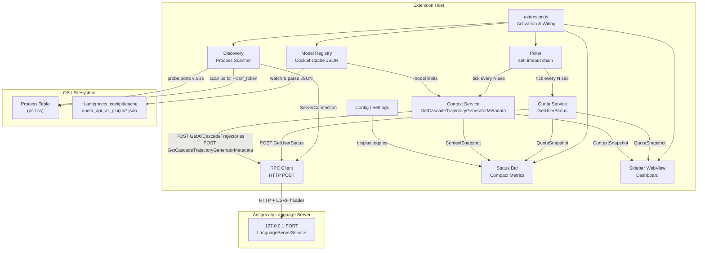
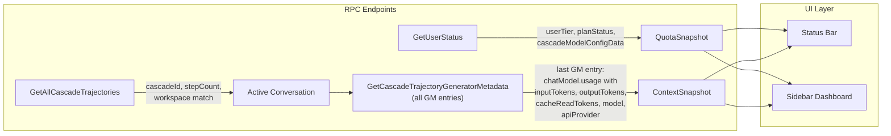
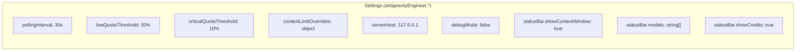

# Antigravity Engineer — Architecture

## Overview

VS Code extension for Google Antigravity IDE that provides real-time monitoring of context window usage, model quotas, and token consumption by reverse-engineering the internal language server RPC API.

## Architecture Diagram

## Data Flow

### LS RPC Endpoints — API Reference

| Endpoint | Purpose | Status |
|---|---|---|
| `GetUserStatus` | Plan, quotas, model configs | ✅ Live, primary |
| `GetAllCascadeTrajectories` | Discover cascadeId by workspace | ✅ Live (may return empty) |
| `GetCascadeTrajectoryGeneratorMetadata` | **Token data** — one GM entry per LLM call | ✅ Live, primary |
| `GetCascadeTrajectory` | Trajectory summary + GM (nested) | ⚠️ Works, but heavier + 1 entry behind |
| `GetCascadeTrajectorySteps` | Step buffer (~1135 steps) | ❌ Frozen after checkpoint/truncation |
| `GetUserTrajectoryDescriptions` | List of trajectory IDs per workspace | ✅ Live, discovery only |
| `StreamAgentStateUpdates` | Real-time push of steps | ⏳ Needs Connect streaming framing (future) |
| `GetBrowserOpenConversation` | Currently open conversation | ⚠️ Only works if browser panel is open |

### Token Data Model (from GeneratorMetadata)

Each `generatorMetadata[]` entry contains `chatModel.usage`:

| Field | Type | Description |
|---|---|---|
| `model` | string | Internal model ID (e.g. `MODEL_PLACEHOLDER_M26`) |
| `inputTokens` | string | Uncached prompt tokens sent to model |
| `cacheReadTokens` | string | Cached prompt tokens (Anthropic prompt cache) |
| `outputTokens` | string | Tokens generated by model |
| `responseOutputTokens` | string | Same as outputTokens (always equal) |
| `apiProvider` | string | Provider (e.g. `API_PROVIDER_ANTHROPIC_VERTEX`) |
| `responseId` | string | Request ID (e.g. `req_vrtx_011CZcp...`) |

Additional fields per entry: `stepIndices` (which trajectory steps this LLM call covers), `executionId`, optional `plannerConfig`.

**Context window usage** = `inputTokens + cacheReadTokens + outputTokens`.

> Note: `inputTokens` is the *uncached* portion; `cacheReadTokens` is the *cached* portion.
> Together they represent the full input sent to the model. Both occupy context window space.

### API Behavior Notes

- **`GetCascadeTrajectoryGeneratorMetadata`**: Returns the full `generatorMetadata[]` array directly (not nested inside `trajectory`). Typically 1 entry fresher than `GetCascadeTrajectory`. Response can be large (~7 MB for 500+ entries). No pagination params.
- **`GetCascadeTrajectorySteps`**: Ignores `startIndex`/`endIndex` params entirely. Always returns a frozen ~1135-step buffer. Buffer stops updating after checkpoint/truncation. Not suitable for live tracking.
- **`GetCascadeTrajectory`**: GM entries are nested inside `trajectory.generatorMetadata[]`. Also returns `numTotalSteps` and `numTotalGeneratorMetadata` counts.
- **`StreamAgentStateUpdates`**: Requires Connect streaming framing (`Content-Type: application/connect+json`, binary envelope: `0x00 + uint32_be(length) + JSON`). Returns 415 with regular JSON POST. Accepts `conversationId` (likely same as `cascadeId`).

## Module Responsibilities

### Discovery (`platform/discovery.ts`)
- Scans OS processes for `--csrf_token` flags via `ps aux`
- Discovers listening ports via `ss -tlnp` (Linux) matched by PID
- Probes each port with HTTP POST to `GetUserStatus` to find the JSON-RPC port
- Filters out gRPC/HTTPS ports (only HTTP works without cert conflicts)
- Extracts `ServerConnection { host, port, csrfToken, pid }`

### RPC Client (`platform/rpc-client.ts`)
- JSON-over-HTTP POST to `exa.language_server_pb.LanguageServerService/*`
- CSRF token authentication via `X-Codeium-Csrf-Token` header
- HTTP only (avoiding HTTPS to prevent conflicts with IDE's internal gRPC)

### Poller (`services/poller.ts`)
- Non-overlapping setTimeout chain (not setInterval)
- Exponential backoff on failure (capped at 2 min)
- Immediate recovery to base interval on success
- AbortController for clean shutdown

### Quota Service (`services/quota.ts`)
- Parses `GetUserStatus` → `cascadeModelConfigData` for per-model quotas
- `remainingFraction` is 0.0–1.0 float (missing = 0% = depleted)
- Extracts `userTier.name` for plan name (e.g. "Google AI Ultra")
- Extracts `userTier.availableCredits` for total AI credits
- Normalizes prompt/flow credits with percentage calculations
- Alphabetically sorted model list for stable UI

### Context Service (`services/context.ts`)
- **Step 1**: `GetAllCascadeTrajectories` → find conversation matching current workspace URIs
- **Step 2**: `GetCascadeTrajectoryGeneratorMetadata` with `cascadeId` → fetch all GM entries
- **Step 3**: Walk backwards to find latest GM entry with non-zero token data
- **Step 4**: Extract `inputTokens + cacheReadTokens + outputTokens` = context window usage
- **Debug logging**: Peak context, model distribution, last 3 entries trend
- Model detection via `apiProvider` → display name mapping
- Context limits from Model Registry (`maxTokens` per model)
- **No estimation fallback** — only shows real data, empty if no conversation exists for workspace

### Model Registry (`services/model-registry.ts`)
- Reads `~/.antigravity_cockpit/cache/quota_api_v1_plugin/authorized/*.json`
- Parses chat model metadata: `displayName`, `maxTokens`, `modelId`
- FSWatcher for live updates when cache files change
- Provides `getChatModels()` to Context Service for limit resolution

### Status Bar (`ui/statusbar.ts`)
- Format: `$(pulse) Opus 133K/200K (67%) | 🟢Flash 100% 🔴Opus 0% | 💎10K`
- Configurable sections via settings:
  - `statusBar.showContextWindow` — toggle context display
  - `statusBar.models` — filter which models show quota dots (empty = all)
  - `statusBar.showCredits` — toggle credits display
- Model grouping: deduplicates variants (e.g. Gemini Pro High/Low → "Pro")
- Short names: Opus, Sonnet, Pro, Flash, GPT
- Rich tooltip with full breakdown
- Click → opens sidebar dashboard

### Sidebar (`ui/sidebar/provider.ts`)
- WebView with CSP + nonce security
- Native VS Code theme variable integration (`--vscode-*`)
- Sections: Connection, Context Window (with progress bar), Model Quotas, Credits
- PostMessage bridge for state updates
- Refresh and Show Logs buttons

## Configuration

## Security Model

- All traffic is local (`127.0.0.1` only)
- CSRF token from process arguments (never stored externally)
- WebView uses Content Security Policy with nonce
- No external network calls
- No telemetry or analytics
- Token values redacted in diagnostic logs
