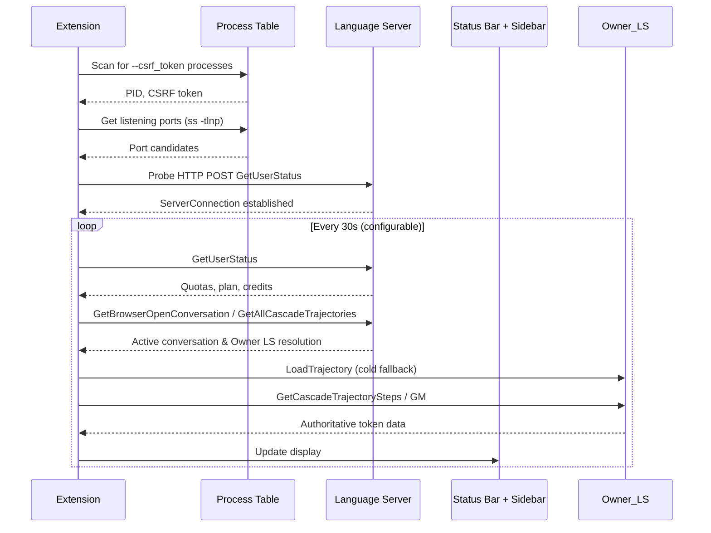

# Antigravity Engineer

VS Code extension for Google Antigravity IDE that monitors **context window usage**, **model quotas**, and **token consumption** in real-time by reverse-engineering the internal language server RPC API.

## Features

### 📊 Context Window Monitor
- **Actual token data** from server-computed `estimatedTokensUsed`
- `inputTokens + cacheReadTokens` = full cached and uncached sizes
- Visual progress bar showing context fill percentage
- Automatic model detection from `apiProvider` field
- Workspace-aware: only shows data for the current project

### 📈 Model Quota Dashboard
- Per-model quota percentages with reset timers
- Plan name and AI credits from `userTier` data
- Prompt and Flow credit tracking
- Low/critical quota warnings with configurable thresholds
- Alphabetically sorted for stable UI

### 🔌 Status Bar
- Compact display: `$(pulse) Opus 133K/200K (67%) | 🟢Flash 100% 🔴Opus 0% | 💎10K`
- Colored dots: 🟢 >30% | 🟡 1–30% | 🔴 0%
- **Configurable**: choose which models to show, toggle context/credits
- Rich tooltip with full breakdown
- Click to open dashboard

### 📋 Sidebar Dashboard
- Connection status with port and PID info
- Context window gauge with progress bar and token breakdown
- Model quota list with percentages and reset timers
- Plan info, AI credits, prompt/flow credits
- Refresh and Show Logs buttons

## How It Works



All communication is **100% local** — no external API calls, no telemetry, no data leaves your machine.

## Installation

### From .vsix file
```bash
# Build and package
npm install
npm run build
npm run package

# Install in Antigravity
antigravity --install-extension antigravity-engineer-0.3.7.vsix
```

### From source (development)
```bash
npm install
npm run watch
# Press F5 to launch Extension Development Host
```

## Configuration

| Setting | Default | Description |
|---|---|---|
| `pollingInterval` | 30 | Seconds between polls |
| `lowQuotaThreshold` | 30 | Warning at this % remaining |
| `criticalQuotaThreshold` | 10 | Critical at this % remaining |
| `contextLimitOverrides` | {} | Per-model limit overrides |
| `statusBar.showContextWindow` | true | Show context window in status bar |
| `statusBar.models` | [] | Models to show in status bar (empty = all). Use short names: `Opus`, `Sonnet`, `Pro`, `Flash`, `GPT` |
| `statusBar.showCredits` | true | Show AI credits in status bar |
| `debugMode` | false | Verbose logging |

All settings are prefixed with `antigravityEngineer.`

## RPC Endpoints Used

| Endpoint | Purpose | Key Fields |
|---|---|---|
| `GetUserStatus` | Quotas, plan, credits | `userTier`, `planStatus`, `cascadeModelConfigData` |
| `GetBrowserOpenConversation` | Active chat detection (Pass 1) | `cascadeId` |
| `GetAllCascadeTrajectories` | Active chat fallback (Pass 2) | `trajectorySummaries[id].workspaces`, `stepCount` |
| `GetCascadeTrajectory` | Trajectory summary, step/GM counts | `numTotalSteps`, `numTotalGM`, `status` |
| `GetCascadeTrajectorySteps` | Primary token source | `inputTokens`, `cacheReadTokens`, `outputTokens`, `apiProvider` |
| `GetCascadeTrajectoryGeneratorMetadata` | Fallback token source + `estimatedTokensUsed` | `chatModel.usage`, `chatModel.contextWindowMetadata` |
| `LoadTrajectory` | Cold start recovery | `cascadeId` |

## Privacy & Security

- ✅ 100% local-first — all communication on `127.0.0.1`
- ✅ No telemetry, analytics, or external API calls
- ✅ CSP + nonce on WebView content
- ✅ No credential storage or exfiltration

## Architecture

See `ARCHITECTURE.md` for detailed module breakdown and Mermaid diagrams.

## License

MIT
